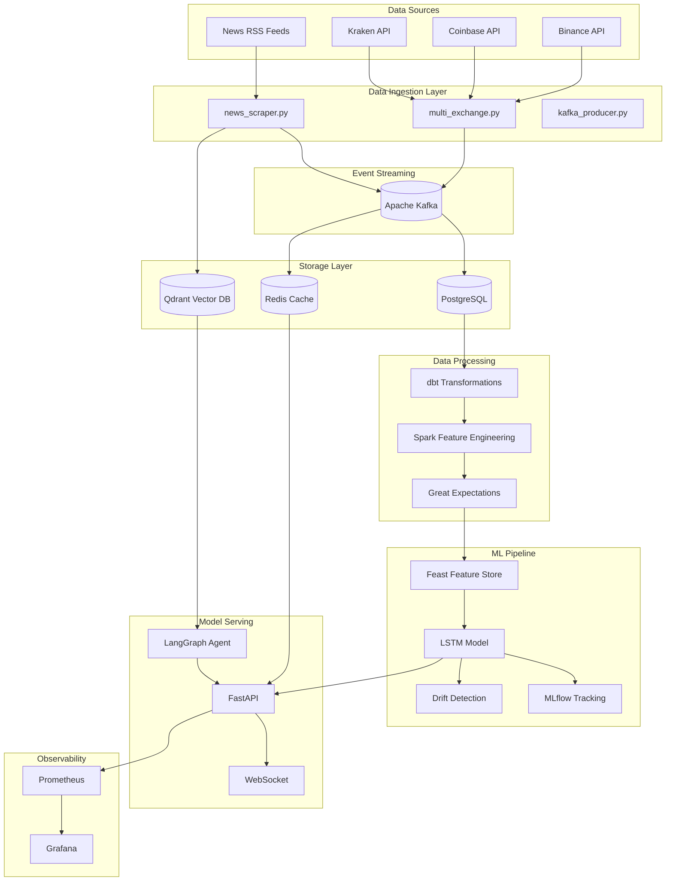

# Data Lineage Documentation

## Overview

This document describes the data flow through the Sentinance platform, from data ingestion to model predictions.

## Data Flow Diagram



## Data Sources

### Exchange Data
| Source | Endpoint | Data Type | Frequency |
|--------|----------|-----------|-----------|
| Binance | `/api/v3/ticker/24hr` | Price, Volume, Change | Real-time |
| Coinbase | `/products/{id}/ticker` | Price, Volume | Real-time |
| Kraken | `/0/public/Ticker` | Price, Volume | Real-time |

### News Data
| Source | Format | Data Type |
|--------|--------|-----------|
| CoinDesk RSS | RSS/Atom | Headlines, Summaries |
| CoinTelegraph | RSS/Atom | Headlines, Summaries |

## Transformation Pipeline

### Stage 1: Raw Ingestion
- **Location:** `apps/api/multi_exchange.py`
- **Output:** Raw price ticks with timestamps
- **Schema:**
  ```
  symbol: string (PK)
  price: float
  volume: float
  change_24h: float
  timestamp: datetime
  exchange: string
  ```

### Stage 2: Kafka Events
- **Location:** `apps/api/kafka_producer.py`
- **Topic:** `sentinance.prices`
- **Format:** JSON
- **Partitioning:** By symbol

### Stage 3: dbt Staging
- **Location:** `apps/dbt/models/staging/stg_prices.sql`
- **Materialization:** Incremental
- **Transformations:**
  - Type casting
  - Deduplication
  - Null handling

### Stage 4: dbt Marts
- **Location:** `apps/dbt/models/marts/`
- **Tables:**
  - `mart_daily_metrics` - OHLCV aggregations
  - `mart_technical_indicators` - RSI, MACD, Bollinger

### Stage 5: Feature Engineering
- **Location:** `apps/spark/spark_features.py`
- **Features:**
  - Moving averages (SMA, EMA)
  - RSI, MACD, Bollinger Bands
  - Time-based features (hour, day_of_week)
  - Volume features (ratio, change)

### Stage 6: Feature Store
- **Location:** `apps/feature_store/feature_store.py`
- **Backend:** Feast (local SQLite)
- **Feature Views:**
  - `price_features` - Real-time prices
  - `technical_indicators` - TA indicators
  - `market_features` - Market aggregates

## ML Pipeline

### Training Flow
```
Historical Data (yfinance)
    ↓
Data Preprocessing (normalize, sequence)
    ↓
LSTM Training (PyTorch)
    ↓
MLflow Logging (metrics, model)
    ↓
Model Registry (versioning)
    ↓
Deployment (model weights saved)
```

### Inference Flow
```
Feature Store (real-time features)
    ↓
Model Loading (lstm_BTCUSDT.pt)
    ↓
Prediction (price forecast)
    ↓
A/B Testing (variant routing)
    ↓
API Response
```

## Data Quality Checks

| Check | Location | Frequency |
|-------|----------|-----------|
| Price > 0 | Great Expectations | Every batch |
| Volume >= 0 | Great Expectations | Every batch |
| Change in [-50%, +100%] | Great Expectations | Every batch |
| No null timestamps | Great Expectations | Every batch |
| Drift detection | drift_detection.py | Daily |

## Latency SLAs

| Stage | Target Latency | Measurement |
|-------|---------------|-------------|
| Exchange fetch | < 500ms | Prometheus histogram |
| Kafka produce | < 50ms | Prometheus histogram |
| Cache read | < 10ms | Prometheus histogram |
| Model inference | < 100ms | Prometheus histogram |
| E2E API response | < 1s | Prometheus histogram |

## Data Retention

| Data Type | Retention | Storage |
|-----------|-----------|---------|
| Raw prices | 90 days | PostgreSQL |
| Aggregated metrics | 2 years | PostgreSQL |
| Model artifacts | Indefinite | MLflow/S3 |
| Logs | 30 days | Prometheus |

## Audit Trail

All data transformations are logged:
- **dbt:** Audit columns (created_at, updated_at)
- **MLflow:** Experiment tracking with full provenance
- **Prefect:** Flow execution history
- **Git:** Infrastructure as code versioning
